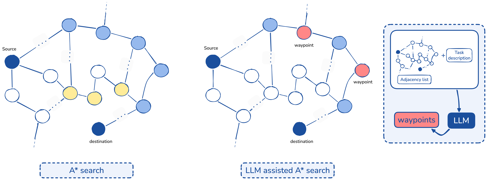

# LLM-aided A* for networks
[]()

This repository contains the source code for the paper ["<u>LLM-Aided A* Search in Non-Geometric Network Graphs</u>"](https://arxiv.org/abs/2606.23136).

### ABSTRACT
We propose a large language model (LLM)- aided A* algorithm in which an LLM generates intermediate waypoints that guide the A* expansion toward promising graph regions. On the solver side, we adopt the landmark- based (ALT) heuristic, which replaces geometric estimates with admissible lower bounds derived from precomputed shortest path distances to a small set of landmark nodes via the triangle inequality. On the LLM side, we inject the resulting heuristic estimates into the waypoint generation prompt, where they act as a surrogate coordinate system that restores to the model the distance-to-destination signal it loses on abstract graphs. Guided by this signal, the LLM proposes a set of intermediate waypoints, and the estimated distance to the current waypoint augments the A* evaluation function, biasing expansion toward promising regions of the graph while A* remains the underlying solver.




### How to run code
1. clone the repository
```
git clone https://github.com/Nouf-Alabbasi/LLM-aided-A-star-for-networks
```
2. run ``run_main.py``
 - this will produce the graphs and run both A* and LLM A* and produce a CSV file with the results

### results


Figure 1: Results on graphs with 50–100 nodes. Comparison of standard A* and LLM-aided A* on graphs with 50 and 100 nodes. yellow nodes represent expanded nodes. Dark blue nodes indicate the final path, while red nodes denote LLM-generated waypoints, which guide the search and reduce exploration.


Figure 2: Comparison of standard A* and LLM-aided A* on larger graphs (250–2000 nodes). Yellow nodes represent expanded nodes. Dark blue nodes indicate the final path, while red nodes denote LLM-generated waypoints guiding the search.


## Citation
```
@misc{alabbasi2026llmaidedasearchnongeometric,
      title={LLM-Aided A* Search in Non-Geometric Network Graphs}, 
      author={Nouf Alabbasi and Esraa Ghourab and Omar Alhussein},
      year={2026},
      eprint={2606.23136},
      archivePrefix={arXiv},
      primaryClass={cs.NI},
      url={https://arxiv.org/abs/2606.23136}, 
}
```

